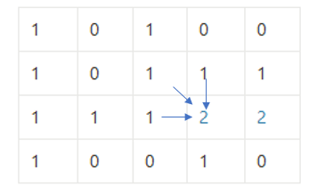

# 221. Maximal Square

문제 링크: [링크](https://leetcode.com/problems/maximal-square/description/)

주어진 matrix에서 1이 담긴 칸으로 이루어진 정사각형의 가장 큰 면적을 구해야 하는 문제.

매 케이스마다 다른 방식으로 계산하려면 복잡성이 매우 커져 DP를 의심해봐야 한다. 

점화식은 아래와 같게 세운다.

1. 시작 조건: 0번째 행과 열을 그대로 유지하고 (1, 1) 위치부터 계산한다.
2. DP 계산: 각 칸을 탐색하며 0일 때와 1일 때를 나눠 계산한다.
   - 0인 경우: 현재 위치 DP 값은 0
   - 1인 경우: 왼쪽, 위쪽, 왼쪽 대각선 위의 세 값 중 최솟값에 1을 더한 값을 현재 위치 DP 값으로 설정

위와 같이 DP를 계산하면 가장 큰 정사각형의 가장 오른 아래쪽 대각선의 칸에 정사각형의 한 변의 면적 값이 들어가게 되고,  
정사각형이 아니면 변화 없이 유지되도록 DP 점화식이 작동하게 된다. 

그래서 DP 점화식을 연산하면서 갱신되는 칸 속의 최댓값이 정사각형의 최대 면적이니까 그걸 제곱해주면 요구하는 output을 만들어 낼 수 있게 된다.

그런데 점화식 시작 조건을 수행하기 위해 matrix을 읽을 때 max값을 갱신하지 않으면 