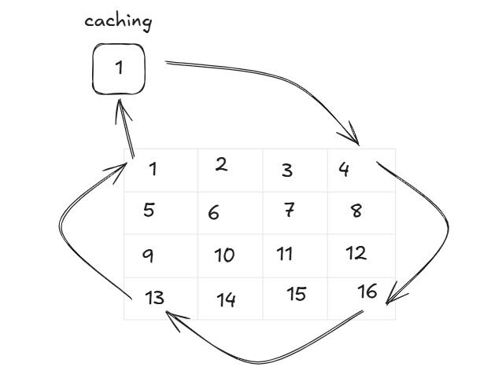
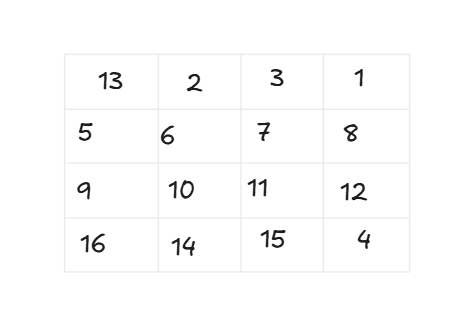
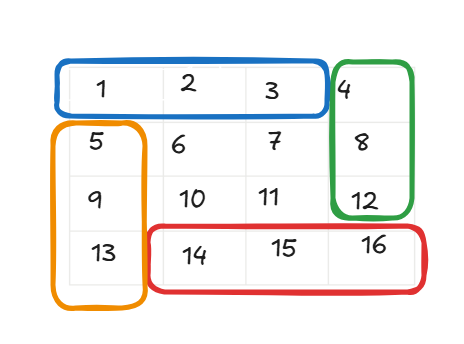

# 48. Rotate Image

문제 링크: [링크](https://leetcode.com/problems/rotate-image/description/)

N * N 의 정사각형 형태의 행렬을 90도 회전하는 방법을 궁리하는게 주 포인트이다. 

왼오 꼭지점에서 오른아래 꼭지점을 잇는 대각선을 기준으로 좌우 반전을 시킨 후,  
중앙 수직 직선을 기준으로 상하 반전을 시키면 90도 회전을 한 결과와 같아진다.

---

가장 바깥층부터 돌리고 그 안의 층을 돌리고, 그렇게 N의 절반까지 돌리는 연산을 하는 방법도 있다. 

이런 풀이법이 다른 문제들에 응용될 가능성이 있어 이해해두는 것이 좋을 것 같다.

사각형 꼭짓점에 위치하는 네 곳을 돌릴 때 한 곳을 캐싱해두고 세 곳을 돌린 후에 마지막 위치에 캐싱해뒀던 값을 위치시키는 것을 회전 연산 방법으로 사용한다. 그렇게 회전 연산에 매칭되는 네 곳을 돌린 후에 다음 네 곳을 또 돌린다. 

이렇게 inplace를 시키면 아래처럼 될 것이고

그 다음으로 돌릴 것들을 묶어서 보면 아래와 같아서

파란색은 행은 고정인데 열이 증가하며, 초록색은 열이 고정인데 행이 증가하는 규칙이 있다.

이를 for 반복문의 i를 이용해 구현할 수 있다.