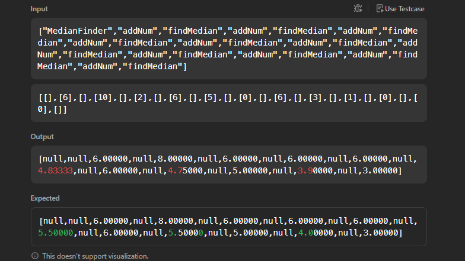

# 295. Find Median from Data Stream

문제 링크: [링크](https://leetcode.com/problems/find-median-from-data-stream/)

코드에 문제는 없는거 같고 잘 작동하는 거 같은데 직접 case를 계산해봐도 왜 틀린 건지 모르겠다. 

5.5가 아니라 4.8이 맞는거 같은데 잘 모르겠다.

---

원소 개수가 짝수 개일 때 전부 더해서 원소 개수로 나누는게 아니라 정렬했을 때 중앙에 위치하는 값 두개를 더해 2로 나누라는 것이 문제가 정의하는 중앙값이었다.