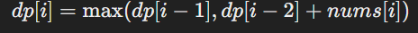

# [198. House Robber](https://leetcode.com/problems/house-robber/description/)

You are a professional robber planning to rob houses along a street. Each house has a certain amount of money stashed, the only constraint stopping you from robbing each of them is that adjacent houses have security systems connected and **it will automatically contact the police if two adjacent houses were broken into on the same night**.

Given an integer array `nums` representing the amount of money of each house, return the maximum amount of money you can rob tonight **without alerting the police**.

**Example 1**:

> **Input**: nums = [1,2,3,1]  
> **Output**: 4  
> **Explanation**: Rob house 1 (money = 1) and then rob house 3 (money = 3).  
> Total amount you can rob = 1 + 3 = 4.

**Example 2**:

> **Input**: nums = [2,7,9,3,1]  
> **Output**: 12  
> **Explanation**: Rob house 1 (money = 2), rob house 3 (money = 9) and rob house 5 (money = 1).   
> Total amount you can rob = 2 + 9 + 1 = 12.


**Constraints**:

- 1 <= nums.length <= 100 
- 0 <= nums[i] <= 400

---

이 문제는 Dynamic Programming (DP) 을 활용하여 해결하는 것이 가장 적절합니다.
주어진 문제에서 "연속된 집을 털 수 없다" 는 제약이 있기 때문에, 최적 부분 구조(optimal substructure) 와 중복 부분 문제(overlapping subproblems) 가 존재하여 DP로 접근할 수 있습니다.

## 풀이 접근

1. **DP 배열 정의**:
   - `dp[i]`를 i번째 집까지 고려했을 때 얻을 수 있는 최대 금액 으로 정의합니다.
2. **점화식 유도**:
   - 현재 집 i를 털 경우: `dp[i-2]` + `nums[i]`
   - 현재 집 i를 털지 않을 경우: `dp[i-1]`
   - 따라서 점화식은 다음과 같습니다.  
     
3. **초기 조건 설정**:
   - 집이 하나만 있을 경우: `dp[0] = nums[0]`
   - 집이 두 개 있을 경우: `dp[1] = max(nums[0], nums[1])`
4. **최적해 도출**:
   - dp 배열을 채운 후, dp[n-1]이 최종 정답이 됩니다.

## 자바 코드 구현 (DP 사용)

```java
public class HouseRobber {
    public int rob(int[] nums) {
        int n = nums.length;
        if (n == 0) return 0;
        if (n == 1) return nums[0];

        int[] dp = new int[n];
        dp[0] = nums[0];
        dp[1] = Math.max(nums[0], nums[1]);

        for (int i = 2; i < n; i++) {
            dp[i] = Math.max(dp[i - 1], dp[i - 2] + nums[i]);
        }

        return dp[n - 1];
    }

    public static void main(String[] args) {
        HouseRobber robber = new HouseRobber();
        int[] nums1 = {1, 2, 3, 1};
        int[] nums2 = {2, 7, 9, 3, 1};
        System.out.println(robber.rob(nums1)); // 4
        System.out.println(robber.rob(nums2)); // 12
    }
}
```

## 공간 최적화 (O(1) 공간)

위의 코드에서는 dp 배열을 사용하여 O(N) 공간 을 사용하지만, 사실 `dp[i]` 값을 구할 때 `dp[i-1]` 과 `dp[i-2]` 만 필요합니다.
즉, 두 개의 변수만 유지하면서 문제를 풀 수 있습니다.

```java
public class HouseRobber {
    public int rob(int[] nums) {
        int n = nums.length;
        if (n == 0) return 0;
        if (n == 1) return nums[0];

        int prev2 = nums[0];
        int prev1 = Math.max(nums[0], nums[1]);

        for (int i = 2; i < n; i++) {
            int curr = Math.max(prev1, prev2 + nums[i]);
            prev2 = prev1;
            prev1 = curr;
        }

        return prev1;
    }
}
```

## 시간 복잡도 분석

- O(N): 단 한 번의 for 루프를 통해 배열을 순회하며 최적해를 구함.

## 공간 복잡도 분석

- O(N) (배열 사용 시) → dp 배열을 사용하여 저장.
- O(1) (공간 최적화 버전) → prev1, prev2 만 유지.
