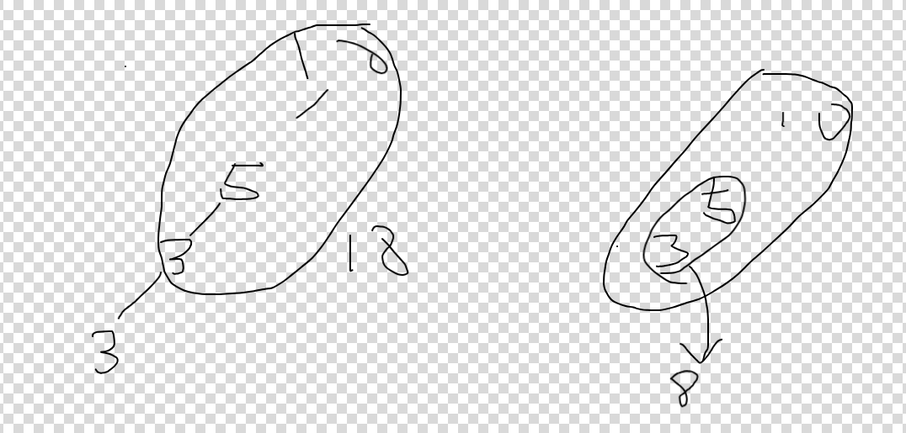

# 437. Path Sum III

문제 링크: [링크](https://leetcode.com/problems/path-sum-iii/)

로직 설계가 어려워 풀지 못한 문제. 매우 어렵다고 느꼈다. 매우매우매우.

```java
/**
 * Definition for a binary tree node.
 * public class TreeNode {
 *     int val;
 *     TreeNode left;
 *     TreeNode right;
 *     TreeNode() {}
 *     TreeNode(int val) { this.val = val; }
 *     TreeNode(int val, TreeNode left, TreeNode right) {
 *         this.val = val;
 *         this.left = left;
 *         this.right = right;
 *     }
 * }
 */

class Solution {
    public int pathSum(TreeNode root, int targetSum) {
        Map<Long, Integer> prefixSumCount = new HashMap<>();
        prefixSumCount.put(0L, 1); // 누적합이 0인 경로를 기본적으로 1개로 설정
        return dfs(root, 0, targetSum, prefixSumCount);
    }

    private int dfs(TreeNode node, long currSum, int targetSum, Map<Long, Integer> prefixSumCount) {
        if (node == null) return 0;

        // 현재 누적 합 계산
        currSum += node.val;

        // (현재 누적 합 - targetSum)이 prefixSumCount에 존재하면 해당 개수를 결과에 추가
        int count = prefixSumCount.getOrDefault(currSum - targetSum, 0);

        // 현재 누적 합을 prefixSumCount에 추가
        prefixSumCount.put(currSum, prefixSumCount.getOrDefault(currSum, 0) + 1);

        // 왼쪽과 오른쪽 서브트리 탐색
        count += dfs(node.left, currSum, targetSum, prefixSumCount);
        count += dfs(node.right, currSum, targetSum, prefixSumCount);

        // 백트래킹: 현재 노드의 누적 합 제거
        prefixSumCount.put(currSum, prefixSumCount.get(currSum) - 1);

        return count;
    }
}
```

각 노드에서 DFS를 하면서 특정 누적 합이 나타난 횟수를 맵 타입의 자료구조에 기록해두면, 그 자료구조에서 누적합에서 targetSum 값을 뺀 걸 키값으로 value를 찾아오면 그 value가 그 누적합을 만들어 낼 수 있는 누적합 Path의 갯수가 된다.
```
      10
     /  \
    5   -3
   / \     \
  3   2     11
 / \   \
3  -2   1
```
`targetSum = 8`

다음의 예제를 보자. 

## 누적 합 추적

1. 루트 노드(10)
    - 현재 `currSum = 10`
    - `currSum - targetSum = 10 - 8 = 2`
    - `prefixSumCount`에서 `2`가 없으므로, 경로 개수는 0개
    - `prefixSumCount` 갱신: `{0: 1, 10: 1}`
2. 왼쪽 자식 (5)
   - 현재 `currSum` = 15 (10 + 5). 
   - `currSum - targetSum = 15 - 8 = 7` 
   - `prefixSumCount`에서 `7`이 없으므로, 경로 개수는 0 
   - `prefixSumCount` 갱신: `{0: 1, 10: 1, 15: 1}` 
3. 왼쪽의 왼쪽 자식 (3)
   - 현재 `currSum = 18` `(10 + 5 + 3)` 
   - `currSum - targetSum = 18 - 8 = 10` 
   - `prefixSumCount`에서 `10`이 1개 있으므로, 누적 합 10에서 현재까지의 경로가 `targetSum`과 일치 
   - 경로 개수는 1
   - `prefixSumCount` 갱신: `{0: 1, 10: 1, 15: 1, 18: 1}`

## "currSum - targetSum = 15 - 8 = 7"

만약 `prefixSumCount`에 `{7: 2}`로 저장되어있다고 하면

"경로 시작점에서 누적 합이 7이 된 시점"이 2번 있었음을 의미한다.

현재 currSum이 15 일 때, `15 - 8 = 7`이니 "누적 합이 7이 된 지점" 두 곳에서 "누적 합이 8이 되는 지점" 까지의 경로의 수가 2개가 있다는 것이 된다.

## 정리

단순히 DFS로만 문제를 푸려면 각 하위 노드마다 루트 노드로써 같은 DFS 연산을 반복하는, 비효율적으로 같은 연산을 반복하는 방법으로 풀어야 하지만 

경로가 반드시 아래 방향으로만 계산되어야 한다는 점에서 특정 경로를 구간 합으로 표현함으로써 계산을 효율적으로 만드는 논리를 세울 수 있다.

DFS를 하면서 쭉 내려오면서 만들어지는 누적 합에서 하위 노드에서 구간 합이 `targetSum`이 되는 경우가 있다고 논리를 잡는 것이다.



구간 합으로 두 누적 합이 차이 계산으로 문제를 풀기 위한 아이디어를 정립해보자.

두 누적 합의 관계를 수식으로 표현하면 `구간 합 = currSum - prevSum` 이고

목표는 "특정 경로의 합이 `targetSum`인 경우를 찾는 것"이므로 `currSum - prevSum = targetSum` 이 된다.

이를 DFS에서 활용할 수 있도록 변형하면 `prevSum = currSum - targetSum`,  
이 식은 "과거에 prevSum이라는 누적합이 존재했다면, 그 지점에서 현재 노드까지의 경로 합이 `targetSum이 된다"는 뜻이 된다.
