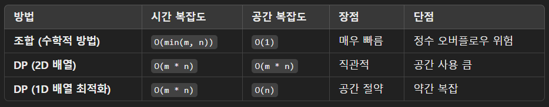

# 62. [Unique Paths](https://leetcode.com/problems/unique-paths/description/)

There is a robot on an m x n grid. The robot is initially located at the top-left corner (i.e., grid[0][0]). The robot tries to move to the bottom-right corner (i.e., grid[m - 1][n - 1]). The robot can only move either down or right at any point in time.

Given the two integers m and n, return the number of possible unique paths that the robot can take to reach the bottom-right corner.

The test cases are generated so that the answer will be less than or equal to 2 * 109.

**Example 1:**


> **Input**: m = 3, n = 7 
> **Output**: 28

**Example 2:**

> **Input**: m = 3, n = 2
> **Output**: 3
> **Explanation**: From the top-left corner, there are a total of 3 ways to reach the bottom-right corner:
> 1. Right -> Down -> Down
> 2. Down -> Down -> Right
> 3. Down -> Right -> Down

**Constraints:**

- 1 <= m, n <= 100

--- 

이 문제는 조합(combination) 또는 **동적 계획법(DP, Dynamic Programming)**을 이용하여 해결할 수 있습니다.

## 접근 방법

### 1. 조합(combination) 사용 (수학적 접근)

로봇이 (m-1, n-1) 위치에 도착하려면, 아래 방향으로 m-1번, 오른쪽 방향으로 n-1번 움직여야 합니다.
즉, (m-1) + (n-1) = (m+n-2) 번의 이동 중에서 m-1번을 아래로 가는 경우를 선택하는 조합의 개수를 구하면 됩니다.


자바에서는 BigInteger를 사용하여 팩토리얼을 계산할 수도 있지만, 조합 공식에서 나눗셈을 이용한 반복 계산 방식을 사용하면 효율적으로 구현할 수 있습니다.

### 2. 동적 계획법(DP) 사용

이 문제는 작은 문제의 해를 이용하여 큰 문제를 해결하는 전형적인 DP 문제로 볼 수도 있습니다.

- `dp[i][j]`를 (i, j) 위치까지 도달하는 경로의 개수라고 정의합니다.
- 경로는 위에서 오는 경우(`dp[i-1][j]`) + 왼쪽에서 오는 경우(`dp[i][j-1]`) 두 가지로 나뉩니다.


초기 조건:

- 첫 번째 행과 첫 번째 열은 1로 채웁니다. (로봇은 한 방향으로만 갈 수 있기 때문)

## 자바 코드

### 1. 조합을 이용한 풀이

```java
import java.math.BigInteger;

public class UniquePaths {
    public static int uniquePaths(int m, int n) {
        return combination(m + n - 2, Math.min(m - 1, n - 1));
    }

    private static int combination(int total, int select) {
        long result = 1;
        for (int i = 0; i < select; i++) {
            result = result * (total - i) / (i + 1);
        }
        return (int) result;
    }

    public static void main(String[] args) {
        System.out.println(uniquePaths(3, 7)); // 출력: 28
        System.out.println(uniquePaths(3, 2)); // 출력: 3
    }
}
```

✔️ 시간 복잡도: O(min(m, n))  
✔️ 공간 복잡도: O(1)

### 2. 동적 계획법(DP) 풀이

```java
public class UniquePathsDP {
    public static int uniquePaths(int m, int n) {
        int[][] dp = new int[m][n];

        // 첫 행과 첫 열을 1로 초기화
        for (int i = 0; i < m; i++) dp[i][0] = 1;
        for (int j = 0; j < n; j++) dp[0][j] = 1;

        // DP 테이블 채우기
        for (int i = 1; i < m; i++) {
            for (int j = 1; j < n; j++) {
                dp[i][j] = dp[i - 1][j] + dp[i][j - 1];
            }
        }

        return dp[m - 1][n - 1];
    }

    public static void main(String[] args) {
        System.out.println(uniquePaths(3, 7)); // 출력: 28
        System.out.println(uniquePaths(3, 2)); // 출력: 3
    }
}
```

✔️ 시간 복잡도: O(m * n)  
✔️ 공간 복잡도: O(m * n)

### 3. 공간 최적화된 DP 풀이 (1차원 배열)

```java
public class UniquePathsOptimized {
    public static int uniquePaths(int m, int n) {
        int[] dp = new int[n];
        for (int j = 0; j < n; j++) dp[j] = 1; // 첫 행 초기화

        for (int i = 1; i < m; i++) {
            for (int j = 1; j < n; j++) {
                dp[j] += dp[j - 1];
            }
        }

        return dp[n - 1];
    }

    public static void main(String[] args) {
        System.out.println(uniquePaths(3, 7)); // 출력: 28
        System.out.println(uniquePaths(3, 2)); // 출력: 3
    }
}
```

✔️ 시간 복잡도: O(m * n)  
✔️ 공간 복잡도: O(n)

## 어떤 방법을 선택해야 할까?



- 빠르고 효율적인 풀이를 원한다면 → 조합 방법 
- 직관적인 풀이를 원한다면 → 2D DP 방법 
- 공간 최적화가 필요하면 → 1D DP 방법

✅ **개인적으로는 조합 방법을 추천합니다.**

자바에서는 long 타입을 활용하면 대부분의 경우 오버플로우를 방지할 수 있기 때문입니다. 하지만 큰 `m, n` 값을 다룬다면 **1D DP 방식**이 가장 안정적일 수 있습니다.